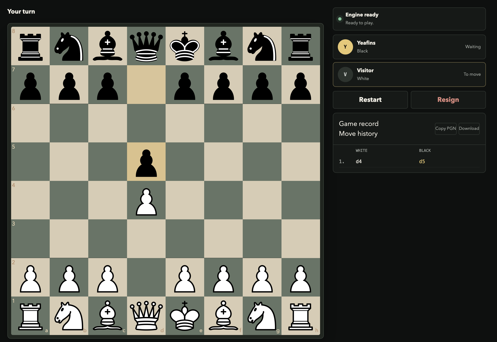

# Yeafins

[](https://www.python.org/)
[](https://pytorch.org/)
[](https://fastapi.tiangolo.com/)
[](https://nextjs.org/)
[](https://www.docker.com/)

A chess engine trained on my own games that combines a neural-network policy with
Stockfish to play in my style.



## Live Demo

- **Website:** [yeafins.vercel.app](https://yeafins.vercel.app)
- **API health:** [yeafins.onrender.com/health](https://yeafins.onrender.com/health)

## Table of Contents

- [Overview](#overview)
- [Features](#features)
- [How It Works](#how-it-works)
- [Model](#model)
- [Engine](#engine)
- [Architecture](#architecture)
- [Local Development](#local-development)
- [API](#api)
- [Tech Stack](#tech-stack)
- [Lessons Learned](#lessons-learned)
- [Future Improvements](#future-improvements)
- [Acknowledgements](#acknowledgements)

## Overview

Traditional chess engines may search millions of positions and select moves primarily
by evaluation strength. Yeafins starts from a different question: **which legal moves
would I naturally consider in this position?**

A residual neural-network policy, trained on positions from my historical games,
predicts a personalized distribution over legal moves. Yeafins keeps the policy's top
16 candidates and asks Stockfish to evaluate only that restricted set. A hybrid
selection step then balances stylistic preference with tactical and positional quality.

This makes Yeafins a practical combination of imitation learning and classical chess
search:

```text
Human Games
     ↓
Position Dataset
     ↓
Neural Network
     ↓
Top-16 Candidate Moves
     ↓
Stockfish (2000 Elo target)
     ↓
Hybrid Selection
     ↓
Final Move
```

The configured Stockfish Elo is an evaluator setting, not a measured playing rating
for the complete Yeafins system.

## Features

- Neural-network policy trained on my chess games
- Hybrid neural-policy and Stockfish move selection
- Legal move masking over a fixed policy output space
- Phase-aware style blending
- Restricted, batched Stockfish MultiPV evaluation
- FastAPI inference service with structured errors and health checks
- Browser-based chess interface built with Next.js and React
- Play as White, Black, or a random colour
- Move history and PGN export
- Responsive desktop and mobile UI
- CPU-only Docker deployment
- Render backend and Vercel frontend

## How It Works

1. The browser sends the current position to FastAPI as a FEN string.
2. The policy network predicts a score for every encoded move.
3. Illegal moves are masked and the top 16 legal policy candidates are retained.
4. Stockfish evaluates all 16 candidates in one restricted MultiPV search.
5. Yeafins combines normalized policy preference and engine evaluation using the
   current game-phase weight.
6. FastAPI returns the selected move and candidate metadata to the browser.

Batching is important for predictable latency. Applying a 1.5-second limit separately
to 16 candidates would allow the request to scale toward 24 seconds of search time.
Yeafins instead sends all proposed moves to one `engine.analyse` call using
`root_moves`, `multipv=16`, and one total time limit.

## Model

Yeafins uses a compact residual convolutional policy network implemented in PyTorch.
It consumes an encoded chess position and produces logits over a fixed 4,672-class
move space.

The inference path:

- encodes the board into feature planes;
- runs the position through the ResNet policy;
- masks every illegal move before normalization;
- converts the strongest legal policy outputs back into chess moves;
- passes the top-k candidates to the hybrid evaluator.

The model is trained from positions extracted from my own games. It is intended to
learn move preference—not to replace tactical search or claim standalone engine
strength. Training checkpoints and smaller inference-only checkpoints are kept
separate so the deployed service does not retain optimizer or scheduler state.

## Engine

The public engine uses the following configuration:

| Setting | Value |
| --- | ---: |
| Candidate count | 16 |
| Stockfish target Elo | 2000 |
| Search budget | 1.5 seconds total |
| Search method | Restricted MultiPV |
| Opening style weight | 0.20 |
| Middlegame style weight | 0.10 |
| Endgame style weight | 0.20 |

The style weight controls how much the final blended score favors the learned policy.
Lower values place more emphasis on Stockfish evaluation. When the API receives
`style_weight: null`, the backend resolves the value from the current game phase.

The backend owns one policy model and one Stockfish process. Requests are serialized
through an application-level lock so concurrent requests do not race over the shared
engine.

## Architecture

```text
┌──────────────────────────────┐
│           Browser            │
│ chess.js + react-chessboard  │
└──────────────┬───────────────┘
               ↓
┌──────────────────────────────┐
│           Next.js            │
│      React + TypeScript      │
└──────────────┬───────────────┘
               ↓ HTTPS / JSON
┌──────────────────────────────┐
│           FastAPI            │
│ validation, CORS, lifecycle  │
└──────────────┬───────────────┘
               ↓
┌──────────────────────────────┐
│           PyTorch            │
│  policy inference + top-k    │
└──────────────┬───────────────┘
               ↓ restricted roots
┌──────────────────────────────┐
│          Stockfish           │
│      one MultiPV search      │
└──────────────┬───────────────┘
               ↓
┌──────────────────────────────┐
│        Hybrid Response       │
│ selected move + candidates   │
└──────────────────────────────┘
```

The browser owns the game state, legal interaction, move history, outcomes, and PGN.
The backend is stateless between requests: every move request contains the complete
current FEN.

## Local Development

### Prerequisites

- Python 3.11 or newer
- Node.js and npm
- Stockfish
- The inference checkpoint at `models/best_inference.pt`

On macOS, Stockfish can be installed with Homebrew:

```sh
brew install stockfish
```

### Backend

Create a virtual environment and install the development dependencies:

```sh
python3.11 -m venv .venv
source .venv/bin/activate
pip install -e '.[dev]'
```

Start the API:

```sh
YEAFINS_CHECKPOINT_PATH=models/best_inference.pt \
STOCKFISH_PATH=/opt/homebrew/bin/stockfish \
ALLOWED_ORIGINS=http://localhost:3000 \
STOCKFISH_THREADS=1 \
STOCKFISH_HASH_MB=16 \
yeafins-api
```

The Stockfish path varies by platform. If `stockfish` is already on `PATH`,
`STOCKFISH_PATH` may be omitted.

### Frontend

In a second terminal:

```sh
cd web
cp .env.example .env.local
npm install
npm run dev
```

Open [http://localhost:3000](http://localhost:3000).

The frontend reads the backend origin from:

```env
NEXT_PUBLIC_ENGINE_API_URL=http://127.0.0.1:8000
```

### Docker

Build the CPU-only production image:

```sh
docker build -t yeafins-api .
```

Run it locally:

```sh
docker run --rm \
  -p 8000:8000 \
  -e ALLOWED_ORIGINS=http://localhost:3000 \
  yeafins-api
```

The image installs CPU-only PyTorch, verifies that CUDA/NVIDIA/Triton packages are
absent, starts one Uvicorn worker, and uses conservative Stockfish memory defaults.
See [the deployment guide](docs/deployment.md) for Render-specific configuration and
memory diagnostics.

## API

The deployed API is stateless and exposes two public endpoints.

### `GET /health`

Reports whether both the policy model and Stockfish are ready.

```sh
curl https://yeafins.onrender.com/health
```

Successful response:

```json
{
  "status": "ok",
  "model_loaded": true,
  "stockfish_available": true
}
```

An unhealthy service returns the same readiness fields with HTTP `503`.

### `POST /move`

Selects one move for the supplied position.

```sh
curl -X POST https://yeafins.onrender.com/move \
  -H 'Content-Type: application/json' \
  -d '{
    "fen": "rnbqkbnr/pppppppp/8/8/8/8/PPPPPPPP/RNBQKBNR w KQkq - 0 1",
    "mode": "blended",
    "top_k": 16,
    "stockfish_elo": 2000,
    "depth": null,
    "time_limit_seconds": 1.5,
    "style_weight": null
  }'
```

Example response shape:

```json
{
  "fen": "rnbqkbnr/pppppppp/8/8/8/8/PPPPPPPP/RNBQKBNR w KQkq - 0 1",
  "selected_move_uci": "e2e4",
  "selected_move_san": "e4",
  "phase": "opening",
  "resolved_style_weight": 0.2,
  "mode": "blended",
  "top_k": 16,
  "stockfish_elo": 2000,
  "candidates": [
    {
      "move_uci": "e2e4",
      "move_san": "e4",
      "model_rank": 1,
      "model_probability": 0.31,
      "stockfish_cp": 24,
      "selected": true
    }
  ],
  "game_over": false,
  "outcome": null
}
```

Candidate values depend on the supplied position and loaded checkpoint; the example
documents the response structure rather than a guaranteed move or evaluation.

Validation failures and engine errors use a structured error body:

```json
{
  "error": {
    "code": "validation_error",
    "message": "The request body failed validation."
  }
}
```

## Tech Stack

| Area | Technology |
| --- | --- |
| Data and training | Python, pandas, PyArrow, scikit-learn |
| Policy model | PyTorch |
| Chess representation | python-chess, NumPy |
| Classical evaluation | Stockfish |
| Backend | FastAPI, Pydantic, Uvicorn |
| Frontend | Next.js, React, TypeScript |
| Browser chess state | chess.js, react-chessboard |
| Testing | pytest, Vitest, Testing Library |
| Containerization | Docker |
| Hosting | Render, Vercel |

## Lessons Learned

- **Imitation learning needs a well-defined target.** Predicting personal move
  preference is different from maximizing chess strength, so legality and evaluation
  must be handled explicitly.
- **Legal masking belongs in the model-serving path.** Filtering before top-k selection
  ensures every proposed candidate can be played in the supplied position.
- **Model serving includes dependency design.** CPU-only PyTorch, inference-only
  checkpoints, and keeping training imports out of API startup materially reduce
  deployment memory.
- **Search budgets must apply at the right level.** One time limit per candidate caused
  latency to scale with `top_k`; restricted MultiPV makes the limit apply once to the
  full position.
- **Shared native resources require coordination.** One Stockfish process is protected
  by a serialized backend lock instead of being accessed concurrently.
- **Frontend and backend responsibilities should be explicit.** The browser owns the
  game, while the stateless API owns Yeafins move selection.

## Future Improvements

- Add a personalized opening book
- Train and compare stronger policy architectures
- Evaluate ONNX Runtime for lower inference memory
- Add optional accounts and saved games
- Persist game history with appropriate privacy controls
- Add operational analytics and latency monitoring
- Display an evaluation graph and move-by-move analysis
- Integrate with Lichess for bot or study workflows
- Establish repeatable playing-strength and style-similarity evaluations

## Acknowledgements

- [Stockfish](https://stockfishchess.org/) for classical chess analysis.
- [python-chess](https://python-chess.readthedocs.io/) for board representation, PGN
  support, move legality, and UCI engine integration.
